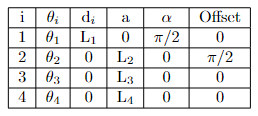

# Laboratorio 5: PhantomX Pincher
Este repositorio contiene la cinematica inversa para el robot PhantomX pincher.

### Cinematica Inversa

Primero se establecen los parametros de Denavit Hatenberg

Conociendo las coordenadas de los puntos a los que queremos llevar el manipulador del robot (x,y,z) y usando el metodo geometrico tenemos que para la articulación 1:

como el movimiento de la articulación 3 se tiene que 

