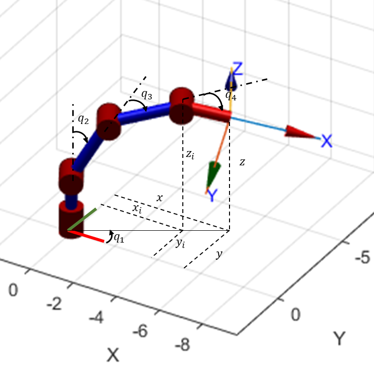
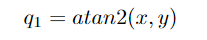
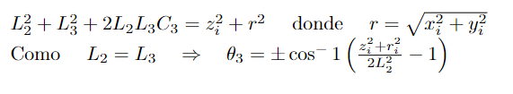
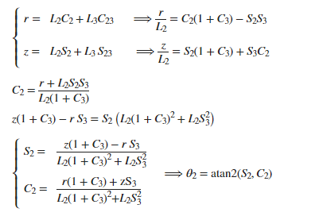

# Laboratorio 5: PhantomX Pincher
Este repositorio contiene el desarrollo del laboratorio 5 de Robotica, en el cual se realiza la cinematica inversa del robot PhantomX Pincher con el objetivo de implementarlo en una aplicación de escritura, que se logra a partir de un script de python que envia al robot los valores articulares hallados con la cinematica inversa según la rutina seleccionada por el usuario.

Nota: Este video se encuentra a una velocidad aumentada de 5x 

## Cinematica Inversa

Usando el diagrama mostrado a continuacion se desarrolla la cinematica inversa del manipulador PhantomX Pincher
<p align="center"></p>

Conociendo las coordenadas de los puntos a los que queremos llevar el manipulador del robot (x,y,z) y usando el metodo geometrico tenemos que para la articulación 1:
<p align="center"></p>

Para este mecanismo se tiene 2 posibles configuraciones para las articulaciones 2 y 3, codo arriba y codo abajo. Para la articulacion 3 se tiene que:

<p align="center"></p>

Con la articulacion 2 se plantea sus soluciones en función de las coordenadas y la articulacion 3.
<p align="center"></p>

Para la articulacion 4 se tiene que  

## Metodología 
Aqui el pirobo de cristian explica qué hace del excel para atrás 
### Modelo 2D 

### Construccion del Excel 

### Manejo de datos (valores articulares)
Una vez se obtienen los valores articulares se procede a generar una matriz nx5 con la sintaxis requerida por python, esta matriz se copia al script Datos.py y se genera una función que acceda al vector requerido dentro de la matriz, a continuación se muestra la logica de programación descrita
```python
import math
cargar=[[-1.57,0,0,0,0],
        [-1.57,1.57,0,0,0],
        [-1.57,1.57,0,0,1],
        [-1.57,1,0,0,1],
        [0,0,0,0,1]]

def F_carga(i):     
    return (cargar[i][0],cargar[i][1],cargar[i][2],cargar[i][3],cargar[i][4])
```

### Lógica de ejecución
El script consiste en un case que relaciona las diferentes rutinas con los numeros enunciados en el menú, al pulsar la tecla indicada se incia un lector de tiempo que cuantifica el tiempo de ejecución de la rutina, posteriormente inicia un ciclo for en el cual se genera comunicación mediante ROS con las articulaciones que componen el robot, a cada una se le envia un valor que se obtiene al llamar las funciones creadas en el script datos.py, a demás de esto, el valor articular es convertido de radianes a grados y mostrado en pantalla junto al nombre de la rutina que se está ejecutando, también se implementa un condicional que lee el valor de la última articulación y según el rango en el que se encunetre determina si el gripper se encuentra abierto o cerrado. Una vez recorrida la matriz con todos los puntos se finaliza el ciclo for, se informa al usuario que la rutina ha finalizado y se calcula e indica  el tiempo de ejecución a partir de la diferencia entre el momento de inicio y fin

```python
   if key == '2': ##CARGA HERRAMIENTA 
            inicio2 = time.time()
            for i in range(0,5,1):
                    
                    state = JointTrajectory()
                    state.header.stamp = rospy.Time.now()
                    state.joint_names = ["joint_1", "joint_2","joint_3", "joint_4", "tool"]
                    point = JointTrajectoryPoint()
                    point.positions = datos.F_carga(i) 
                    point.time_from_start = rospy.Duration(0.4)
                    state.points.append(point)
                    pub.publish(state)
                    print(f"Pose: {round(math.degrees(point.positions[0]),2)}, {round(math.degrees(point.positions[1]),2)},        
                    {round(math.degrees(point.positions[2]),2)}, {round(math.degrees(point.positions[3]),2)},
                    {round(math.degrees(point.positions[4]),2)}  Rutina: Carga de herramienta " )
                    
                    if point.positions[4] > 0.9:
                        print("Herramienta cargada")
                    else:
                        print("Herramienta descargada")
                    rospy.sleep(3)
            print("Rutina < Carga de herramienta > Finalizada")
            fin2 = time.time()
            print(f"Tiempo de ejecución de rutina {fin2-inicio2} s")        
```
